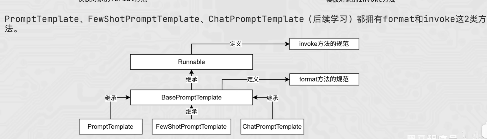
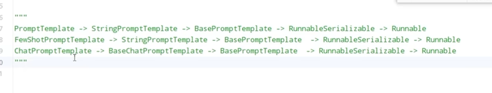
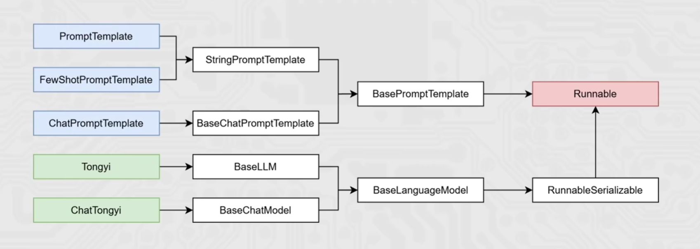
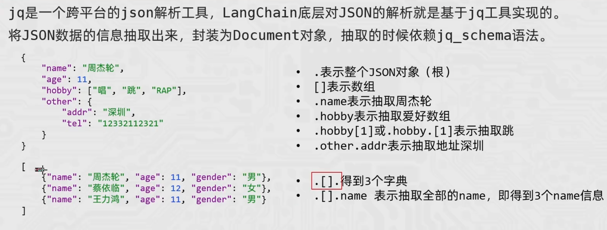
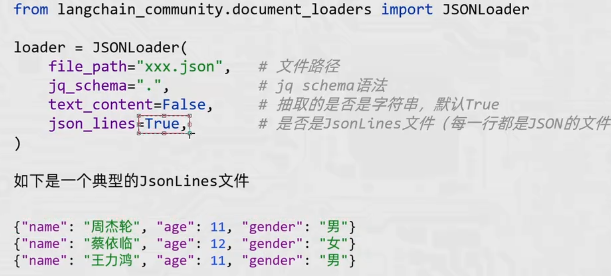

ollama: ollama.com/search
cmd中: ollama run 模型名称     （运行模型）
ollama api调用: http://localhost:11434/v1
streamlit 运行命令: D:\AI_RAG_AGENT\RNGProject>streamlit run app_file_upload.py

openai库基础：

    {"role": "assistant", "content": "我是你的助手。"},
    {"role": "user", "content": "你是谁"}

    message中的assistant相当于提交给ai的历史记录

LangChain:
    1、pip install langchain langchain-community langchain-ollama dashscope chromadb -i https://pypi.tuna.tsinghua.edu.cn/simple
        langchain:核心包
        langchain-community:社区支持包(千问模型需要这个包)
        langchain-ollama:Ollama支持包
        dashscope:阿里云通义千问的python SDK
        chromadb:轻量向量数据库

2、通义千问qwen-max是llms， qwen3-max是chat， 输出qwen-max用的是chunk, 输出qwen3-max用的是chunk.content
        for chunk in model.stream(input=message):
        print(chunk, end='', flush=True)
        print(chunk.content, end='', flush=True)

3、三类模型 llm、chat、text-embedding

4、FewShotPromptTemplate、PromptTemplate、ChatPromptTemplate中都有invoke和formate方法
    继承关系：
        
        
    区别：
        format： 
            字符串替换，得到的是string 
            .format(a=?,b=?)
            解析替换{}
        invoke： 
            Runnable得到的是PromptValue类对象  
            .invoke({'a':'?', 'b': '?'})
            解析替换{},解析MessagePlaceholder结构化占位符

5、chain链，将组件串联，上1个组件的输出作为下一个组件的输入，必须是Runnable接口的子类才能入链
    

6、jq库用法
    
    

7、pdf分割
    需安装pypdf (pip install pypdf)

8、RunnablePassThrough
    - as_retriever: langchain存储对象中的as_retriever方法可以返回一个Runnable接口的子类对象 
        retriever = vector_storage.as_retriever(search_kwargs={"k"=2})
    - RunnablePassThrough: RunnablePassThrough()在向量库查询入链中： 占位符，可以拿到链条中的输入
    例：chain = (
            {"input": RunnablePassThrough, "context": retriever | format_func} | prompts | model | StrOutputParser()
    )
    chain中第一个主键是{}, {}中第一个主键是retriever(整个链条中第一个入链)， chain.invoke({})中的输入会被RunnablePassThrough() 和 retriever同时拿到
    
二、RNG
    即检索、增强和生成,主要分为两条线:
        - 离线处理:向私有数据库(向量数据库)添加私有知识文档
            ~ 像知识库添加未来的知识文档
            ~ 向模型添加私有文档
            ~ 给出模型参考资料, 规避模型幻觉(一本正经胡说八道)
        - 在线处理:用户提问会先基于私有知识库做检索,获取参考资料,同步组装新的提示词询问大模型获取结果
        